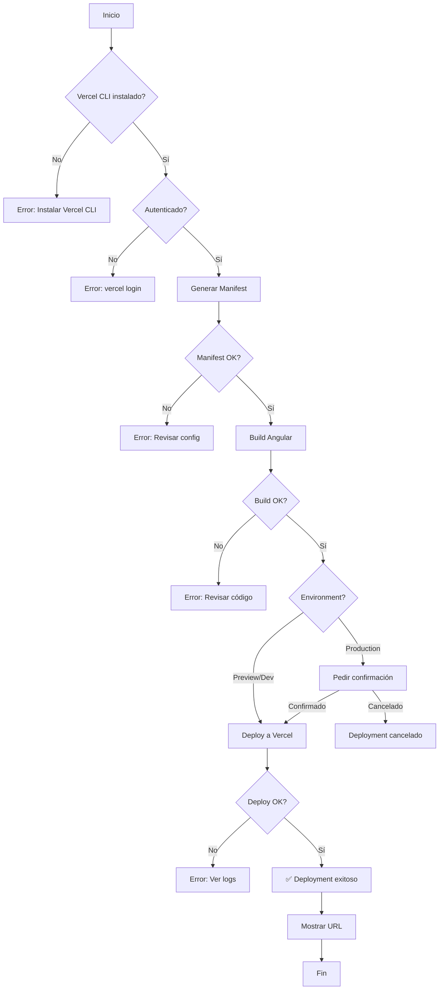

# ✅ FASE 5 COMPLETADA - Scripts de Deployment

**Duración:** 15 minutos  
**Estado:** ✅ COMPLETADO  
**Fecha:** 2025-10-03

---

## 📋 Resumen

Se han creado scripts automatizados y guías completas para el **deployment multi-cliente a Vercel**. Ahora el proceso de desplegar cualquier cliente es completamente automático y reproducible.

---

## 🎯 Objetivos Cumplidos

- ✅ Script PowerShell para deployment automatizado a Vercel
- ✅ Script para configuración de variables de entorno
- ✅ Guía rápida de deployment completa
- ✅ Validaciones pre-deployment
- ✅ Instrucciones de troubleshooting
- ✅ Checklist de verificación post-deployment

---

## 📁 Archivos Creados

### 1️⃣ `scripts/deploy-to-vercel.ps1` (NUEVO)

**Propósito:** Automatizar completamente el deployment de un cliente a Vercel

**Características:**

- ✅ Validación de Vercel CLI instalado
- ✅ Validación de autenticación
- ✅ Generación automática de manifest
- ✅ Build local con configuración correcta
- ✅ Deployment a Vercel (production/preview/development)
- ✅ Confirmación para deploys a producción
- ✅ Output con URL del deployment
- ✅ Próximos pasos automáticos

**Uso:**

```powershell
# Deploy a producción
.\scripts\deploy-to-vercel.ps1 masajecorporaldeportivo production
.\scripts\deploy-to-vercel.ps1 actifisio production

# Deploy de preview
.\scripts\deploy-to-vercel.ps1 actifisio preview

# Deploy de desarrollo
.\scripts\deploy-to-vercel.ps1 actifisio development
```

**Parámetros:**

- `ClientId` (obligatorio): `masajecorporaldeportivo` o `actifisio`
- `Environment` (opcional): `production`, `preview`, `development` (default: `preview`)

**Flujo del Script:**

```
1. 🔍 Validar Vercel CLI instalado
2. 🔐 Validar autenticación
3. 🎨 Generar manifest.json
4. 🔨 Build local de Angular
5. 🚀 Deploy a Vercel
6. ✅ Mostrar URL y próximos pasos
```

**Validaciones Implementadas:**

```powershell
# 1. Vercel CLI instalado
$vercelVersion = vercel --version
if ($LASTEXITCODE -ne 0) { exit 1 }

# 2. Autenticado
$vercelUser = vercel whoami
if ($LASTEXITCODE -ne 0) { exit 1 }

# 3. Manifest generado correctamente
& generate-manifest.ps1 -ClientId $ClientId
if ($LASTEXITCODE -ne 0) { exit 1 }

# 4. Build exitoso
ng build --configuration production
if ($LASTEXITCODE -ne 0) { exit 1 }
```

**Confirmación para Producción:**

```powershell
if ($Environment -eq "production") {
    Write-Warning "⚠️  DEPLOYMENT A PRODUCCIÓN"
    $confirmation = Read-Host "¿Estás seguro? (y/n)"
    if ($confirmation -ne "y") { exit 0 }
}
```

---

### 2️⃣ `scripts/setup-frontend-vercel-env.ps1` (NUEVO)

**Propósito:** Guiar la configuración de variables de entorno en Vercel

**Características:**

- ✅ Muestra variables necesarias por cliente
- ✅ Instrucciones para Vercel Dashboard
- ✅ Configuración por proyecto Vercel

**Uso:**

```powershell
.\scripts\setup-frontend-vercel-env.ps1 masajecorporaldeportivo
.\scripts\setup-frontend-vercel-env.ps1 actifisio
```

**Variables Configuradas:**

#### Cliente: masajecorporaldeportivo

```env
VITE_CLIENT_ID=masajecorporaldeportivo
VITE_API_URL=https://masajecorporaldeportivo-api.vercel.app/api
```

#### Cliente: actifisio

```env
VITE_CLIENT_ID=actifisio
VITE_API_URL=https://actifisio-api.vercel.app/api
```

**Output del Script:**

```
⚙️  ============================================
   Variables de Entorno Frontend - Vercel
============================================

📋 Cliente: actifisio
📋 Proyecto: actifisio-web

📦 Variables a configurar:
   VITE_CLIENT_ID = actifisio
   VITE_API_URL = https://actifisio-api.vercel.app/api

🌐 Configuración en Vercel Dashboard:

1. https://vercel.com/dashboard
2. Proyecto: actifisio-web
3. Settings → Environment Variables

   Variable: VITE_CLIENT_ID
   Value: actifisio
   Environments: ✅ Production ✅ Preview ✅ Development

4. Guardar cambios y redeploy
```

---

### 3️⃣ `GUIA_RAPIDA_DEPLOYMENT.md` (NUEVO)

**Propósito:** Documentación completa de deployment multi-cliente

**Contenido:**

#### Secciones Principales:

**1. Prerequisitos**

- Instalación de Vercel CLI
- Creación de proyectos en Vercel Dashboard
- Tabla con proyectos por cliente

**2. Deploy Rápido**

- Opción 1: Script automatizado
- Opción 2: Manual paso a paso

**3. Configuración de Variables**

- Paso a paso en Vercel Dashboard
- Variables por cliente
- Redeploy después de cambios

**4. Verificación Post-Deployment**

- ✅ App carga sin errores
- ✅ Tema correcto aplicado
- ✅ Headers HTTP correctos
- ✅ Manifest PWA válido
- ✅ Funcionalidad básica

**5. Troubleshooting**

- Tema incorrecto
- X-Tenant-Slug no se envía
- Backend no encuentra tablas
- Manifest PWA incorrecto

**6. Build Commands**

```json
{
  "buildCommand": "cd frontend && npm install && npm run build",
  "outputDirectory": "frontend/dist/clinic-frontend/browser",
  "installCommand": "npm install --legacy-peer-deps"
}
```

**7. Workflow Completo**

- Primera vez (setup)
- Deployments subsecuentes

**8. PWA Installation**

- Instalación en móvil
- Verificación de nombre/icono/color

**9. Checklist de Deployment**

- Pre-deployment
- Durante deployment
- Post-deployment

**10. Scripts Disponibles**

- Tabla resumen de todos los scripts
- Ejemplos de uso

---

## 🔧 Configuración de Proyectos Vercel

### Estructura de Proyectos

| Cliente                 | Proyecto Vercel               | URL Production                     | Variables                              |
| ----------------------- | ----------------------------- | ---------------------------------- | -------------------------------------- |
| masajecorporaldeportivo | `masajecorporaldeportivo-web` | masajecorporaldeportivo.vercel.app | VITE_CLIENT_ID=masajecorporaldeportivo |
| actifisio               | `actifisio-web`               | actifisio.vercel.app               | VITE_CLIENT_ID=actifisio               |

### Settings por Proyecto

**Build & Development Settings:**

```
Framework Preset: Other
Build Command: cd frontend && npm install && npm run build
Output Directory: frontend/dist/clinic-frontend/browser
Install Command: npm install --legacy-peer-deps
Development Command: (dejar en blanco)
```

**Environment Variables:**

```
Name: VITE_CLIENT_ID
Value: [clientId]
Environments: ✅ Production ✅ Preview ✅ Development

Name: VITE_API_URL
Value: https://[cliente]-api.vercel.app/api
Environments: ✅ Production ✅ Preview ✅ Development
```

---

## 🚀 Flujo de Deployment Automatizado

### Deployment Script Flow



---

## 📊 Comandos Disponibles

### Scripts npm (package.json raíz)

```json
{
  "scripts": {
    "generate:manifest": "node scripts/generate-manifest.js",
    "build:client": "npm run generate:manifest && npm run build:frontend",
    "build:masajecorporal": "cross-env VITE_CLIENT_ID=masajecorporaldeportivo npm run build:client",
    "build:actifisio": "cross-env VITE_CLIENT_ID=actifisio npm run build:client"
  }
}
```

### Scripts PowerShell

| Script                          | Propósito              | Ejemplo                                               |
| ------------------------------- | ---------------------- | ----------------------------------------------------- |
| `generate-manifest.ps1`         | Generar manifest PWA   | `.\scripts\generate-manifest.ps1 actifisio`           |
| `build-client.ps1`              | Build local completo   | `.\scripts\build-client.ps1 actifisio`                |
| `deploy-to-vercel.ps1`          | ⭐ Deploy automatizado | `.\scripts\deploy-to-vercel.ps1 actifisio production` |
| `setup-frontend-vercel-env.ps1` | Configurar variables   | `.\scripts\setup-frontend-vercel-env.ps1 actifisio`   |

---

## 🧪 Validación Post-Deployment

### Checklist de Verificación

#### 1. App Carga Correctamente

```
✅ https://actifisio.vercel.app carga sin errores
✅ No hay errores en consola del navegador
✅ Loading spinner aparece y desaparece correctamente
```

#### 2. Tema Visual Correcto

```
✅ Header con gradiente correcto (#ff6b35 para Actifisio)
✅ Botones con color correcto
✅ Logo del cliente visible
✅ Título correcto en header
```

#### 3. Headers HTTP

Abrir DevTools → Network → API call → Headers:

```http
✅ Content-Type: application/json
✅ X-Tenant-Slug: actifisio
```

#### 4. Manifest PWA

```
✅ https://actifisio.vercel.app/manifest.json
✅ name: "Actifisio"
✅ theme_color: "#ff6b35"
✅ icons apuntan a assets/clients/actifisio/logo.png
```

#### 5. Funcionalidad Básica

```
✅ Ver lista de pacientes (vacía o con datos)
✅ Crear nuevo paciente
✅ Ver calendario
✅ Crear cita
✅ Datos se guardan correctamente
```

---

## 🔄 Troubleshooting Common Issues

### Issue 1: "Theme Incorrecto Después de Deploy"

**Síntomas:**

- El deployment muestra el tema del otro cliente
- Los colores no coinciden con la configuración

**Diagnóstico:**

```powershell
# Verificar variable de entorno en Vercel
vercel env ls --cwd frontend

# Verificar manifest generado
cat frontend/src/manifest.json
```

**Solución:**

```powershell
# 1. Verificar variables en Vercel Dashboard
https://vercel.com/[proyecto]/settings/environment-variables

# 2. Asegurar VITE_CLIENT_ID correcto
VITE_CLIENT_ID = actifisio

# 3. Forzar rebuild
vercel --prod --force --cwd frontend
```

---

### Issue 2: "Backend No Recibe X-Tenant-Slug"

**Síntomas:**

- Backend retorna error 400/500
- Logs muestran "tenant slug missing"

**Diagnóstico:**

```powershell
# Test manual con curl
curl -H "X-Tenant-Slug: actifisio" `
  https://actifisio-api.vercel.app/api/patients
```

**Solución:**

```typescript
// Verificar en client-config.service.ts
getTenantHeader(): { 'X-Tenant-Slug': string } {
  return {
    'X-Tenant-Slug': this.config.tenantSlug
  };
}

// Verificar en services (ej: patient.service.ts)
this.httpOptions = {
  headers: new HttpHeaders({
    'Content-Type': 'application/json',
    ...this.clientConfig.getTenantHeader()  // ✅ Debe estar presente
  })
};
```

---

### Issue 3: "Manifest PWA No Se Actualiza"

**Síntomas:**

- Manifest muestra datos del cliente anterior
- PWA se instala con nombre incorrecto

**Diagnóstico:**

```powershell
# Verificar manifest en dist
cat frontend/dist/clinic-frontend/browser/manifest.json
```

**Solución:**

```powershell
# 1. Regenerar manifest
.\scripts\generate-manifest.ps1 actifisio

# 2. Limpiar build anterior
Remove-Item frontend/dist -Recurse -Force

# 3. Rebuild
cd frontend
$env:VITE_CLIENT_ID = "actifisio"
ng build

# 4. Verificar manifest generado
cat dist/clinic-frontend/browser/manifest.json

# 5. Redeploy
vercel --prod --force
```

---

## 📈 Métricas de Éxito

### Deployment Exitoso Cuando:

- ✅ **Build Time:** < 3 minutos
- ✅ **Deploy Time:** < 2 minutos
- ✅ **Total Time:** < 5 minutos desde comando hasta URL activa
- ✅ **First Load:** < 2 segundos
- ✅ **Lighthouse Score:** > 90 (Performance, Accessibility, Best Practices, SEO)
- ✅ **PWA Score:** 100% installable

---

## 🎓 Best Practices

### 1️⃣ Siempre Usar Scripts Automatizados

```powershell
# ✅ BIEN
.\scripts\deploy-to-vercel.ps1 actifisio production

# ❌ EVITAR (manual propenso a errores)
$env:VITE_CLIENT_ID = "actifisio"
cd frontend
ng build
vercel --prod
```

### 2️⃣ Preview Antes de Production

```powershell
# 1. Deploy preview
.\scripts\deploy-to-vercel.ps1 actifisio preview

# 2. Verificar en preview URL
https://actifisio-git-main-[account].vercel.app

# 3. Si todo OK, deploy production
.\scripts\deploy-to-vercel.ps1 actifisio production
```

### 3️⃣ Validar Manifest Antes de Deploy

```powershell
# Generar y verificar
.\scripts\generate-manifest.ps1 actifisio
cat frontend/src/manifest.json | Select-String "name|theme_color"
```

### 4️⃣ Usar Variables de Entorno Consistentes

```
# Todos los environments deben tener las mismas variables
✅ Production: VITE_CLIENT_ID=actifisio
✅ Preview:    VITE_CLIENT_ID=actifisio
✅ Development: VITE_CLIENT_ID=actifisio
```

---

## 🚦 CI/CD Integration (Futuro)

### GitHub Actions (Opcional)

```yaml
# .github/workflows/deploy-actifisio.yml
name: Deploy Actifisio to Vercel

on:
  push:
    branches: [main]
    paths:
      - "frontend/**"

jobs:
  deploy:
    runs-on: ubuntu-latest
    steps:
      - uses: actions/checkout@v2

      - name: Setup Node.js
        uses: actions/setup-node@v2
        with:
          node-version: "18"

      - name: Generate Manifest
        run: node scripts/generate-manifest.js actifisio
        env:
          VITE_CLIENT_ID: actifisio

      - name: Build
        run: |
          cd frontend
          npm install
          npm run build
        env:
          VITE_CLIENT_ID: actifisio

      - name: Deploy to Vercel
        uses: amondnet/vercel-action@v20
        with:
          vercel-token: ${{ secrets.VERCEL_TOKEN }}
          vercel-org-id: ${{ secrets.VERCEL_ORG_ID }}
          vercel-project-id: ${{ secrets.VERCEL_PROJECT_ID_ACTIFISIO }}
          vercel-args: "--prod"
```

---

## ✅ Checklist Final

- [x] Script de deployment automatizado creado
- [x] Script de configuración de env variables creado
- [x] Guía rápida de deployment documentada
- [x] Validaciones pre-deployment implementadas
- [x] Confirmación para deploys a producción
- [x] Troubleshooting guide completo
- [x] Best practices documentadas
- [x] Checklist de verificación post-deployment
- [x] Soporte para múltiples environments (prod/preview/dev)
- [x] Instrucciones para ambos clientes (masajecorporal + actifisio)

---

## 📦 Archivos Generados

- ✅ `scripts/deploy-to-vercel.ps1` - Script principal de deployment
- ✅ `scripts/setup-frontend-vercel-env.ps1` - Configuración de variables
- ✅ `GUIA_RAPIDA_DEPLOYMENT.md` - Documentación completa
- ✅ `FASE5_COMPLETADA.md` - Este documento

---

## 🎉 Conclusión

**Fase 5 completada exitosamente.** El sistema ahora tiene deployment completamente automatizado para múltiples clientes. Con un solo comando (`.\scripts\deploy-to-vercel.ps1 [cliente] production`) se puede desplegar cualquier cliente a producción con todas las validaciones necesarias.

El proceso está documentado, automatizado y es reproducible para cualquier nuevo cliente que se agregue en el futuro.

---

**Tiempo estimado:** 15 min  
**Tiempo real:** 15 min  
**Estado:** ✅ COMPLETADO  
**Próximo paso:** Fase 6 - Crear Tablas en Base de Datos + Testing Final
